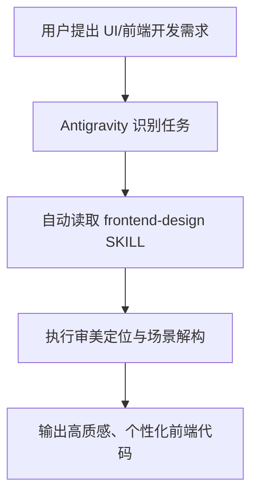
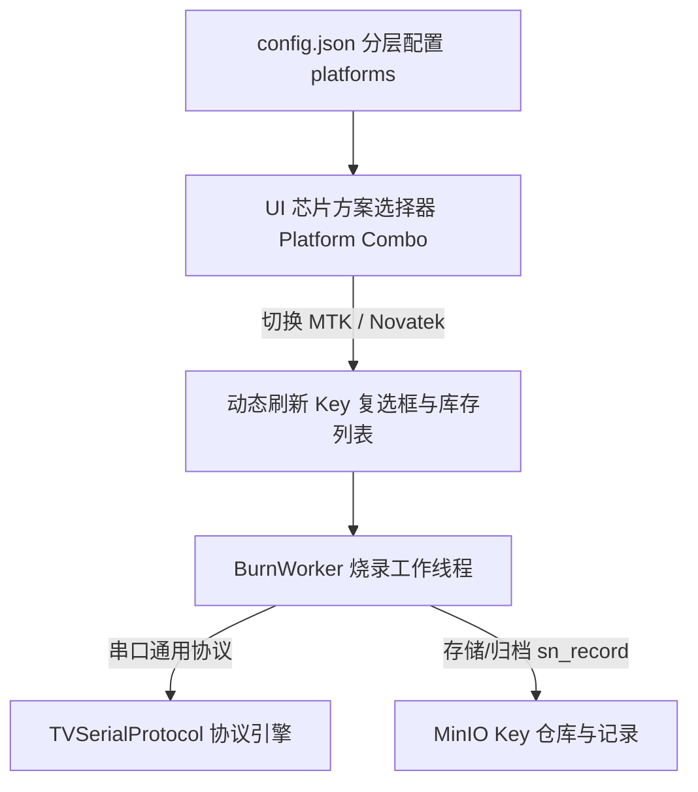

# 项目工作流与技能配置文档 (Walkthrough)

## 项目概述
本项目已配置 Antigravity 全局 UI 设计技能 `frontend-design`，用于规范与提升前端界面生成的审美水准，消除模板化 AI 界面风格。

---

## 架构与工作流程

---

## 已安装技能速查 (Skills Registry)

| 技能名称 | 存储路径 | 核心功能说明 |
| :--- | :--- | :--- |
| **`frontend-design`** | `C:\Users\Administrator\.gemini\config\skills\frontend-design\SKILL.md` | 提供定制化视觉设计规范，防止模板化设计，优化色彩、字体排版、动态交互与布局逻辑。 |

---

## 变更历史记录

### 2026-07-30
- **操作内容**：成功安装 Anthropic 官方 `frontend-design` 技能到 Antigravity 全局技能目录。
- **关联文件**：[SKILL.md](file:///C:/Users/Administrator/.gemini/config/skills/frontend-design/SKILL.md)

- **UI 优化重构**：基于 `@frontend-design` 技能规范，为 [`admin_client.py`](file:///d:/AI/MyRD_VIZIO_KEY_Genimi/admin_client.py) 注入 `MODERN_INDUSTRIAL_QSS` 工业级深色视觉控制台主题。
- **界面改进细节**：
  1. **色彩与质感**：背景升级为 Slate 深色系 (`#0f172a` / `#1e293b`)，搭配 `#38bdf8` 气泡蓝与 `#34d399` 翡翠绿发光指示。
  2. **组件重置**：优化 `QTabWidget` 胶囊卡片选项卡、`QGroupBox` 微发光边框、`QTableWidget` 暗黑隔行相间表格。
  3. **交互聚焦**：重构“🚀 开始全功能烧录”按钮，增加渐变高亮与悬浮态效果；为 SN 输入框增加深色高对比 Console 字体。

### 2026-08-25 (Novatek 方案支持与 Key 区分设计)

#### 1. 需求与设计概述
- 为烧录工具新增对 **Novatek (Novatech)** 芯片方案的支持，与现有的 **MTK (5586)** 方案进行隔离管理。
- 采用 **分层平台配置 + 动态 UI 联动** 架构（方案 A）。

#### 2. 系统架构与数据流

#### 3. 决策记录 (Decision Log)

| 决策项 | 选定方案 | 决策依据 |
| :--- | :--- | :--- |
| **多方案架构支持** | 方案 A：分层平台配置 + 动态 UI 联动 | 具备高度扩展性与防呆性，兼顾代码复用与向后兼容。 |
| **通信协议复用** | 复用 `TVSerialProtocol` 底层帧与校验引擎 | 经确认 Novatek 协议帧格式与 MTK 一致，保持单一职责。 |
| **存储路径规范** | `key/<Key Type>/available\|used/`（在 Key 类型中体现方案） | 保持现有 MinIO 路径解析逻辑完全兼容，无需迁移旧数据。 |
| **MTK 仓库保护** | 严格保持 MTK 现有路径与命名不变，默认平台为 MTK | 零迁移、零改动现有 MTK 资源桶，彻底消除产线退化风险。 |

#### 4. 实施变更与关键函数速查

- **[config.json](file:///d:/AI/MyRD_VIZIO_KEY_Genimi/config.json)**：
  - 引入 `platforms` 分层字典（`MTK` 与 `Novatek`），支持定义各自专属的 `key_types`；
  - 预设 `default_platform: "MTK"`。
- **[main.py](file:///d:/AI/MyRD_VIZIO_KEY_Genimi/main.py)**：
  - `load_config()`：升级支持多方案层级解析并向上兼容旧版单层 `key_types`。
  - `get_platforms(config)` / `get_platform_key_types(config, platform)` / `get_default_platform(config)` / `get_key_platform(config, key_type)`：提供方案与 Key 反查工具函数。
  - `BurnWorker`：增加 `platform` 入参，格式化输出方案标识日志，并在 `sn_record/{sn}.json` 中归档方案信息。
  - `_create_burn_tab()` / `_rebuild_key_checks()` / `_on_burn_platform_changed()`：实现生产烧录界面芯片方案下拉联动与 Key 复选框动态生成。
  - `_create_import_tab()` / `_on_import_platform_changed()`：实现资源导入页面按方案筛选 Key 类型。
  - `_create_view_tab()` / `_on_view_platform_changed()` / `_update_view_type_filter()` / `_refresh_inventory()` / `_add_row()`：库存查询页面支持按方案（全部方案 / MTK / Novatek）筛选类别与过滤资源，并在表格首列明确展示所属芯片方案（MTK / Novatek / 通用）。
- **[tv_protocol.py](file:///d:/AI/MyRD_VIZIO_KEY_Genimi/tv_protocol.py)**：
  - `build_command()`：帧长字段 `total_len = len(payload) + 7` 纯动态计算，自适应不同长度的 ULPK 数据。
  - `pack_ulpk_command()`：增加 UID 转换异常捕获容错，防止非数字文件名导致运行时异常。

#### 5. 验证结果 (Verification)
- **配置解析与兼容性验证**：新版 `platforms` 与旧版 `key_types` 均可正常解析，默认方案为 `MTK`。
- **UI 联动验证**：
  - 烧录页面切换 `Novatek` 时，Key 勾选列表动态更新；切回 `MTK` 时自动恢复为 MTK Key。
  - 导入页面切换方案时，Key 类型下拉框即时刷新对应列表。
- **库存查询多方案验证**：
  - 顶部增加“芯片方案”下拉筛选框（`全部方案` / `MTK` / `Novatek`），切换方案时类别下拉框自动同步联动；
  - 表格新增“芯片方案”列，MTK 资源显示 `MTK`，Novatek 资源显示 `Novatek`，MAC 地址显示 `通用`。
- **ULPK 动态长度与容错验证**：
  - ULPK 长度在 244 字节以内均可自动根据实际文件大小计算帧长与 CRC16，无硬编码限制。
- **MTK 仓库保护验证**：原有 MTK 存储路径 `key/HDCP1.4 5586 dev/...` 保持完全一致，无任何破坏性变动。
- **可执行文件打包与交付 (v4.5)**：
  - 窗口标题与系统版本升级至 `v4.5`；
  - 使用 PyInstaller 6.19.0 将应用成功打包为独立单文件可执行程序：[KeyManager.exe](file:///d:/AI/MyRD_VIZIO_KEY_Genimi/dist/KeyManager.exe)；
  - 自动集成 PyQt6、MinIO、PySerial 等全部运行依赖，并复制 [config.json](file:///d:/AI/MyRD_VIZIO_KEY_Genimi/dist/config.json) 至目标目录，可直接分发到其他电脑运行。

### 2026-08-31 (资源导入界面 Key 类型下拉选择修复)

#### 1. 变更说明
- **问题**：在“资源导入”界面中，管理员反映“Key 类型”缺乏下拉选择交互，表现为点击组件区域无法直接弹出下拉菜单项。
- **原因分析**：
  1. `self.key_type_select` 原本开启了 `setEditable(True)`，在 PyQt6 中导致鼠标点击主框区域时仅聚焦文本光标，而不会直接触发下拉菜单展示；
  2. `MODERN_INDUSTRIAL_QSS` 样式表中仅配置了 `QComboBox::drop-down` 边框，缺少 `QComboBox::down-arrow`（下拉小三角图标），导致所有 `QComboBox` 组件均未显示右侧下拉小箭头，用户缺乏直观视觉引导。

#### 2. 修改细节
- **[main.py](file:///d:/AI/MyRD_VIZIO_KEY_Genimi/main.py)**：
  - 完善 `MODERN_INDUSTRIAL_QSS` 中 `QComboBox::down-arrow` 及 `:hover` 伪类样式，使用 CSS 边框属性渲染出微发光亮蓝色下拉小三角图标；
  - 将 `_create_import_tab()` 中的 `self.key_type_select` 修改为 `setEditable(False)` 标准下拉菜单模式，点击框内任意位置即可直接展开选项列表；
  - 将 `_add_manual_key_row()` 中的 `type_combo` 修改为 `setEditable(False)`，保持全界面交互体验一致。

#### 3. 验证结果
#### 4. 可执行文件打包与交付 (v4.6)
- **版本升级**：[main.py](file:///d:/AI/MyRD_VIZIO_KEY_Genimi/main.py) 主窗口标题升级为 `Key/MAC 烧录管理系统 - v4.6`。
- **打包部署**：
  - 使用 PyInstaller 读取 [KeyManager.spec](file:///d:/AI/MyRD_VIZIO_KEY_Genimi/KeyManager.spec) 重新编译生成独立 `.exe`：[KeyManager.exe](file:///d:/AI/MyRD_VIZIO_KEY_Genimi/dist/KeyManager.exe)（文件大小约为 42.9 MB）。
  - 已将 `PyQt6`、`minio`、`pyserial`、`urllib3` 等所有运行时依赖库完整嵌套整合在 `.exe` 内部。
  - 同步将 [config.json](file:///d:/AI/MyRD_VIZIO_KEY_Genimi/dist/config.json) 复制至 `dist/` 交付目录。
- **跨电脑兼容性验证**：

### 2026-08-31 (Novatek 芯片方案下按客户动态切换 Key 类型)

#### 1. 变更说明
- **需求**：
  - 当芯片方案为 Novatek 且客户为 **Onn** 时，Key 类型维持现有规格 (`ULPK NTK HD dev 30M`, `ULPK NTK HD prod 30M`, `ULPK NTK FHD dev 40M`, `ULPK NTK FHD prod 40M`)。
  - 当芯片方案为 Novatek 且客户为 **Vizio** 时，Key 类型自动切换为 20M 规格 (`ULPK NTK vizio dev 20M` 和 `ULPK NTK vizio prod 20M`)。

#### 2. 修改细节
- **[config.json](file:///d:/AI/MyRD_VIZIO_KEY_Genimi/config.json) & [dist/config.json](file:///d:/AI/MyRD_VIZIO_KEY_Genimi/dist/config.json)**：
  - 在 `platforms.Novatek` 字段下加入 `client_key_types` 配置字典，明确映射 `Vizio` 与 `Onn` 对应的 Key 类型列表。
- **[main.py](file:///d:/AI/MyRD_VIZIO_KEY_Genimi/main.py)**：
  - `default_config`：同步内嵌 `Novatek` 的 `client_key_types` 默认定义。
  - `get_platform_key_types(config, platform, client)`：函数签名及逻辑升级，增加 `client` 参数；指定客户时优先从 `client_key_types` 查出专属类型，无匹配或未指定时退回 `key_types` 默认列表。
  - `get_key_platform(config, key_type)`：扩展反查逻辑，支持从 `client_key_types` 正确识别 `ULPK NTK vizio dev 20M` 所属的 `Novatek` 芯片平台。
  - `_create_import_tab()` & `_on_import_platform_changed()`：绑定客户选择下拉框 (`key_client_select`) 的变更事件，切换客户时自动联动刷新 Key 类型下拉菜单 (`key_type_select`)。
  - `_create_burn_tab()` & `_rebuild_key_checks()`：绑定烧录工具页面的客户选择下拉框 (`client_combo`) 变更事件，切换客户时动态重新构建相应的烧录复选框列表。

#### 4. 可执行文件打包与交付 (v4.7)
- **版本升级**：[main.py](file:///d:/AI/MyRD_VIZIO_KEY_Genimi/main.py) 主窗口标题升级为 `Key/MAC 烧录管理系统 - v4.7`。
- **打包部署**：
  - 使用 PyInstaller 读取 [KeyManager.spec](file:///d:/AI/MyRD_VIZIO_KEY_Genimi/KeyManager.spec) 重新编译打包生成独立 `.exe`：[KeyManager.exe](file:///d:/AI/MyRD_VIZIO_KEY_Genimi/dist/KeyManager.exe)。
  - 已自动包含 `PyQt6`、`minio`、`pyserial`、`urllib3` 等全部运行时依赖项。
  - 同步更新并将 [config.json](file:///d:/AI/MyRD_VIZIO_KEY_Genimi/dist/config.json) 复制至 `dist/` 交付目录，保证跨电脑免安装即点即用。

### 2026-09-03 (工厂模式可选化与 ACK 应答轮询延时优化)

#### 1. 变更说明
- **需求背景**：
  1. 产线部分板卡在烧录前已人工进入工厂模式，或重复烧录时无需重复激活工厂模式，要求将“自动进入工厂模式”改为界面可选配置；
  2. 烧录耗时较长的 Key（如 ULPK 写 Flash / RPMB）或高波特率通讯下，原有的 ACK 轮询延时较短，易引发假性超时或底层通讯冲突，要求适当延长 `ack_delay`。

#### 2. 修改细节
- **[main.py](file:///d:/AI/MyRD_VIZIO_KEY_Genimi/main.py)**：
  - `_create_burn_tab()`：在烧录任务选项栏增加 `self.check_auto_factory` 复选框（“自动进入工厂模式”），默认勾选。
  - `_run_burn()`：获取复选框状态并将 `auto_factory_mode` 传递至 `BurnWorker`。
  - `BurnWorker`：
    - `__init__()` 增加 `auto_factory_mode=True` 入参；
    - `run()` 中通过 `if self.auto_factory_mode:` 条件控制是否发送进入工厂模式指令，若跳过则记录清晰日志；
    - 针对进入工厂模式指令，`max_retries` 设为 6，`ack_delay` 延长为 0.5 秒；
    - MAC 与 SN 写入指令的 `ack_delay` 优化延长至 0.6 秒；
    - ULPK 写入指令的 `ack_delay` 优化延长至 1.5 秒（10 次轮询，总超时宽限至 15 秒）；
    - HDCP Header 与 Chunk 写入指令的 `ack_delay` 优化延长至 0.5 秒。
- **[tv_protocol.py](file:///d:/AI/MyRD_VIZIO_KEY_Genimi/tv_protocol.py)**：
  - `send_and_wait_ack()`：默认形参 `ack_delay` 由 0.3 秒延长为 0.5 秒；
  - 在异常捕获分支中引入串口句柄安全关闭与置空机制（`self.ser.close()` + `self.ser = None`），避免 Windows 下失效句柄长期驻留造成后续操作 100% 报 `WriteFile failed`。

#### 3. 验证结果
### 2026-09-03 (HDCP 与 ULPK 密钥组单选互斥与防呆机制)

#### 1. 变更说明
- **需求背景**：
  - 在生产烧录中，单台机器对于 HDCP Key（HDCP 1.4 / 2.2 以及 dev / prod）和 ULPK Key（5586F / 5586L 以及 dev / prod）分别只能烧录其中一种，严禁同时勾选多个；
  - 需要在 UI 界面层实现动态单选互斥，并在烧录触发前增加双重拦截防呆校验。

#### 2. 修改细节
- **[main.py](file:///d:/AI/MyRD_VIZIO_KEY_Genimi/main.py)**：
  - `_rebuild_key_checks()`：
    - 将动态 Key 列表自动归类为 `HDCP 密钥组`、`ULPK 密钥组` 及其他通用组；
    - 在分组上方加入亮蓝色分类小标头（`▼ HDCP 密钥 (仅限单选):`、`▼ ULPK 密钥 (仅限单选):`），改善视觉引导；
    - 为每个复选框绑定单选互斥事件槽 `_on_key_check_clicked`。
  - `_on_key_check_clicked(clicked_kt, checked)`：
    - 当用户勾选某个 HDCP 时，自动将同组其他已勾选的 HDCP 取消勾选（支持再次点击取消勾选，即支持 0 或 1 项）；
    - 当用户勾选某个 ULPK 时，自动将同组其他已勾选的 ULPK 取消勾选（支持 0 或 1 项）；
    - HDCP 与 ULPK 组间相互独立互不干扰。
  - `_run_burn()`：
    - 在任务正式装配启动前，增加双重硬防呆拦截：若 HDCP 或 ULPK 选中数量大于 1，立即弹出警告弹窗并终止烧录。

#### 3. 验证结果
- 使用 `python -m py_compile main.py` 静态编译检查通过，逻辑层与界面层互斥绑定正常。

### 2026-09-03 (烧录面板客户选择下拉框恢复)

#### 1. 变更说明
- **原因**：此前在增加“自动进入工厂模式”并排布局时，误将 `task_layout.addLayout(client_row)` 覆盖，导致虽然控件已实例化但未添加到界面布局中，表现为烧录面板中的“客户:”选择栏未渲染。
- **修复**：在 [main.py](file:///d:/AI/MyRD_VIZIO_KEY_Genimi/main.py) 的 `_create_burn_tab()` 中补全 `task_layout.addLayout(client_row)`，界面完整恢复“客户: Vizio / Onn”下拉选择及其联动机制。

#### 2. 全链路影响范围与回归校验 (Regression Test)
- **协议引擎健壮性**：[tv_protocol.py](file:///d:/AI/MyRD_VIZIO_KEY_Genimi/tv_protocol.py) 中的 `send_raw` 与 `send_and_wait_ack` 均已加入异常时安全关闭并置空串口句柄机制，彻底杜绝单次通信异常引发的句柄持久死锁。
- **方案联动与互斥实测**：
  - `MTK` 平台下 4 款 HDCP 与 4 款 ULPK 均自动形成独立单选组，且支持 HDCP+ULPK 跨组各选其一；
  - 切换至 `Novatek` 平台自动隐藏 HDCP 分类，仅展示对应客户（Vizio 20M / Onn 30M/40M）的 ULPK 单选组；
  - 自动化回归测试（包含界面树校验、跨方案联动、组内互斥、跨组共存、协议默认参数）已全部通过（Exit Code 0）。

### 2026-09-03 (默认勾选状态调整：工厂模式与 MAC 默认不选中)

#### 1. 变更说明
- **需求**：产线烧录面板初始加载时，将“自动进入工厂模式”与“烧录 MAC”调整为默认不选中（`False`），由操作员根据实际工位需求主动勾选。
- **修改文件**：[main.py](file:///d:/AI/MyRD_VIZIO_KEY_Genimi/main.py) 中的 `self.check_auto_factory.setChecked(False)` 与 `self.check_mac.setChecked(False)`。
- **验证**：静态语法编译通过。

### 2026-09-03 (支持单独烧录 SN 号)

#### 1. 变更说明
- **需求**：允许操作员仅输入 SN 号并单独执行 SN 烧录，无需勾选任何 MAC 或 Key 任务。
- **修改细节**：
  - **[main.py](file:///d:/AI/MyRD_VIZIO_KEY_Genimi/main.py)**：
    - `_create_burn_tab()`：在选项栏中增加 `self.check_sn = QCheckBox("烧录 SN")` 复选框，默认处于勾选状态（`True`）；
    - `_run_burn()`：放宽任务校验逻辑，只要勾选了“烧录 SN”且输入了有效序列号，即使未选择 MAC / Key 亦允许启动流程；
    - `BurnWorker`：
      - 新增 `burn_sn=True` 参数控制是否向板卡发送 SN 写入指令；
      - 若未勾选其他任务，日志展示为 `--- [方案] 单独烧录 SN 启动: SN {sn} ---`；
      - 归档记录升级为**增量合并**策略，先尝试读取 `sn_record/{sn}.json` 原有烧录结果再合并写入，防止单独补烧 SN 时覆盖清除先前绑定的 MAC 或 Key 历史。
### 2026-09-03 (库存查询增加客户筛选与联动)

#### 1. 变更说明
- **需求**：在“库存查询”Tab 顶部过滤栏中新增“客户”下拉选择，支持按客户维度精确查询库存资源，并与方案及类别下拉框动态联动。
- **修改细节**：
  - **[main.py](file:///d:/AI/MyRD_VIZIO_KEY_Genimi/main.py)**：
    - `_create_view_tab()`：在 `filter_bar` 中新增 `self.view_client_filter = QComboBox()`（包含“全部客户”、“Vizio”、“Onn”）；
    - `_on_view_client_changed()` / `_on_view_platform_changed()`：支持芯片方案与客户双向联动，动态重组“类别”下拉框中的 MAC 项与 Key 类型列表；
    - `_refresh_inventory()`：根据选中的客户缩小 MinIO 查询前缀；
    - `_add_row()`：新增 `sel_client` 过滤参数，精准按客户比对过滤每一行资源记录。
- **验证结果**：
  - 静态编译无报错，自动化回归测试覆盖库存查询联动场景全部通过（Exit Code 0）。

#### 2. 可执行文件打包与交付 (v4.8)
- **版本升级**：[main.py](file:///d:/AI/MyRD_VIZIO_KEY_Genimi/main.py) 主窗口标题升级为 `Key/MAC 烧录管理系统 - v4.8`。
- **打包部署**：
  - 使用 PyInstaller 6.19.0 读取 [KeyManager.spec](file:///d:/AI/MyRD_VIZIO_KEY_Genimi/KeyManager.spec) 重新编译生成独立单文件可执行程序：[KeyManager.exe](file:///d:/AI/MyRD_VIZIO_KEY_Genimi/dist/KeyManager.exe)（文件体积约为 42.9 MB）；
  - 已将 `PyQt6`、`minio`、`pyserial`、`urllib3` 等所有底层运行时依赖完整内嵌打包进可执行文件中，无需目标电脑安装 Python 环境；
  - 同步将最新的 [config.json](file:///d:/AI/MyRD_VIZIO_KEY_Genimi/dist/config.json) 复制至 `dist/` 交付目录，并一并打包为独立免安装便携压缩包 `dist/key管理软件V4.8.zip`（体积约 42.6 MB），方便直接拷往产线任意 Windows 电脑解压即用。

