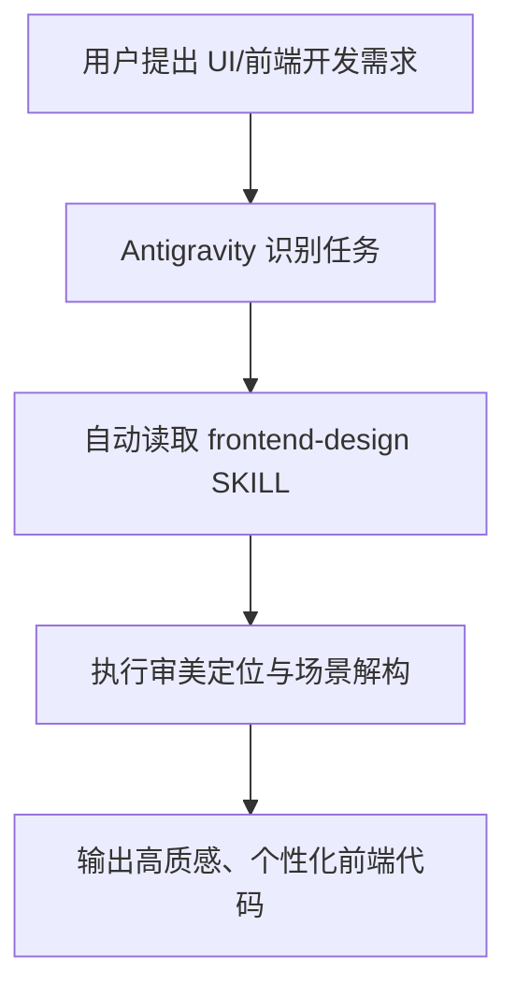

# 项目工作流与技能配置文档 (Walkthrough)

## 项目概述
本项目已配置 Antigravity 全局 UI 设计技能 `frontend-design`，用于规范与提升前端界面生成的审美水准，消除模板化 AI 界面风格。

---

## 架构与工作流程

---

## 已安装技能速查 (Skills Registry)

| 技能名称 | 存储路径 | 核心功能说明 |
| :--- | :--- | :--- |
| **`frontend-design`** | `C:\Users\Administrator\.gemini\config\skills\frontend-design\SKILL.md` | 提供定制化视觉设计规范，防止模板化设计，优化色彩、字体排版、动态交互与布局逻辑。 |

---

## 变更历史记录

### 2026-07-30
- **操作内容**：成功安装 Anthropic 官方 `frontend-design` 技能到 Antigravity 全局技能目录。
- **关联文件**：[SKILL.md](file:///C:/Users/Administrator/.gemini/config/skills/frontend-design/SKILL.md)

- **UI 优化重构**：基于 `@frontend-design` 技能规范，为 [`admin_client.py`](file:///d:/AI/MyRD_VIZIO_KEY_Genimi/admin_client.py) 注入 `MODERN_INDUSTRIAL_QSS` 工业级深色视觉控制台主题。
- **界面改进细节**：
  1. **色彩与质感**：背景升级为 Slate 深色系 (`#0f172a` / `#1e293b`)，搭配 `#38bdf8` 气泡蓝与 `#34d399` 翡翠绿发光指示。
  2. **组件重置**：优化 `QTabWidget` 胶囊卡片选项卡、`QGroupBox` 微发光边框、`QTableWidget` 暗黑隔行相间表格。
  3. **交互聚焦**：重构“🚀 开始全功能烧录”按钮，增加渐变高亮与悬浮态效果；为 SN 输入框增加深色高对比 Console 字体。

