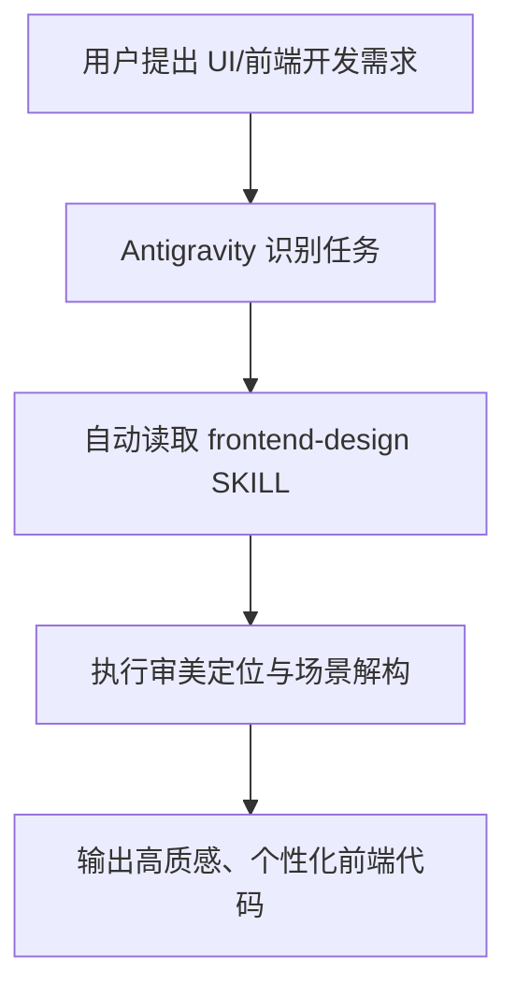
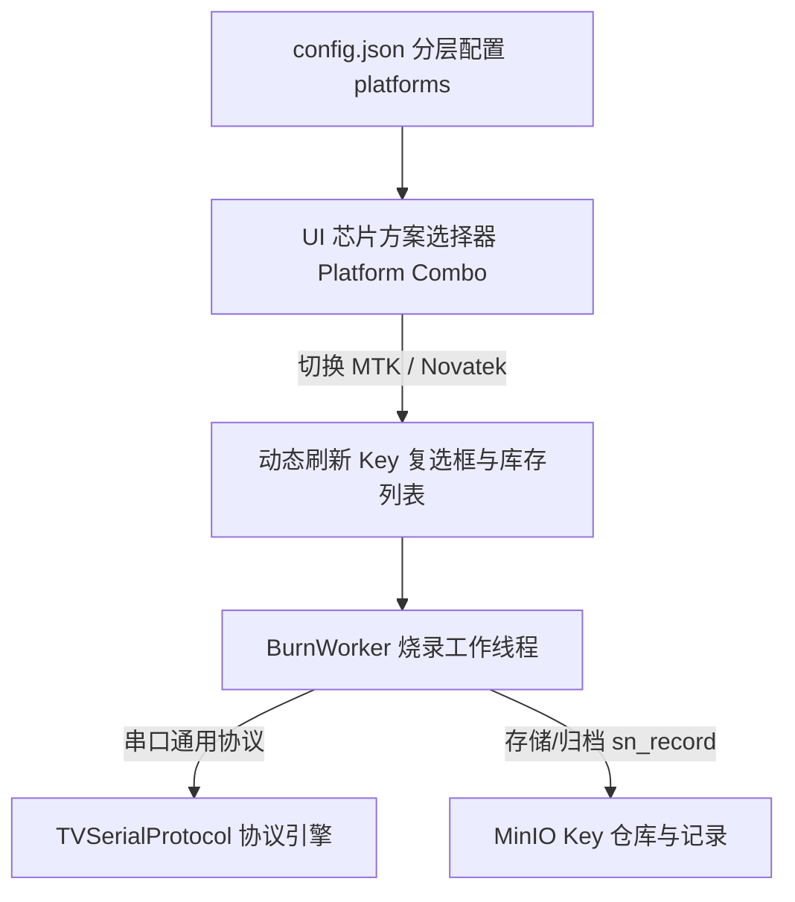

# 项目工作流与技能配置文档 (Walkthrough)

## 项目概述
本项目已配置 Antigravity 全局 UI 设计技能 `frontend-design`，用于规范与提升前端界面生成的审美水准，消除模板化 AI 界面风格。

---

## 架构与工作流程

---

## 已安装技能速查 (Skills Registry)

| 技能名称 | 存储路径 | 核心功能说明 |
| :--- | :--- | :--- |
| **`frontend-design`** | `C:\Users\Administrator\.gemini\config\skills\frontend-design\SKILL.md` | 提供定制化视觉设计规范，防止模板化设计，优化色彩、字体排版、动态交互与布局逻辑。 |

---

## 变更历史记录

### 2026-07-30
- **操作内容**：成功安装 Anthropic 官方 `frontend-design` 技能到 Antigravity 全局技能目录。
- **关联文件**：[SKILL.md](file:///C:/Users/Administrator/.gemini/config/skills/frontend-design/SKILL.md)

- **UI 优化重构**：基于 `@frontend-design` 技能规范，为 [`admin_client.py`](file:///d:/AI/MyRD_VIZIO_KEY_Genimi/admin_client.py) 注入 `MODERN_INDUSTRIAL_QSS` 工业级深色视觉控制台主题。
- **界面改进细节**：
  1. **色彩与质感**：背景升级为 Slate 深色系 (`#0f172a` / `#1e293b`)，搭配 `#38bdf8` 气泡蓝与 `#34d399` 翡翠绿发光指示。
  2. **组件重置**：优化 `QTabWidget` 胶囊卡片选项卡、`QGroupBox` 微发光边框、`QTableWidget` 暗黑隔行相间表格。
  3. **交互聚焦**：重构“🚀 开始全功能烧录”按钮，增加渐变高亮与悬浮态效果；为 SN 输入框增加深色高对比 Console 字体。

### 2026-08-25 (Novatek 方案支持与 Key 区分设计)

#### 1. 需求与设计概述
- 为烧录工具新增对 **Novatek (Novatech)** 芯片方案的支持，与现有的 **MTK (5586)** 方案进行隔离管理。
- 采用 **分层平台配置 + 动态 UI 联动** 架构（方案 A）。

#### 2. 系统架构与数据流

#### 3. 决策记录 (Decision Log)

| 决策项 | 选定方案 | 决策依据 |
| :--- | :--- | :--- |
| **多方案架构支持** | 方案 A：分层平台配置 + 动态 UI 联动 | 具备高度扩展性与防呆性，兼顾代码复用与向后兼容。 |
| **通信协议复用** | 复用 `TVSerialProtocol` 底层帧与校验引擎 | 经确认 Novatek 协议帧格式与 MTK 一致，保持单一职责。 |
| **存储路径规范** | `key/<Key Type>/available\|used/`（在 Key 类型中体现方案） | 保持现有 MinIO 路径解析逻辑完全兼容，无需迁移旧数据。 |
| **MTK 仓库保护** | 严格保持 MTK 现有路径与命名不变，默认平台为 MTK | 零迁移、零改动现有 MTK 资源桶，彻底消除产线退化风险。 |

#### 4. 实施变更与关键函数速查

- **[config.json](file:///d:/AI/MyRD_VIZIO_KEY_Genimi/config.json)**：
  - 引入 `platforms` 分层字典（`MTK` 与 `Novatek`），支持定义各自专属的 `key_types`；
  - 预设 `default_platform: "MTK"`。
- **[main.py](file:///d:/AI/MyRD_VIZIO_KEY_Genimi/main.py)**：
  - `load_config()`：升级支持多方案层级解析并向上兼容旧版单层 `key_types`。
  - `get_platforms(config)` / `get_platform_key_types(config, platform)` / `get_default_platform(config)` / `get_key_platform(config, key_type)`：提供方案与 Key 反查工具函数。
  - `BurnWorker`：增加 `platform` 入参，格式化输出方案标识日志，并在 `sn_record/{sn}.json` 中归档方案信息。
  - `_create_burn_tab()` / `_rebuild_key_checks()` / `_on_burn_platform_changed()`：实现生产烧录界面芯片方案下拉联动与 Key 复选框动态生成。
  - `_create_import_tab()` / `_on_import_platform_changed()`：实现资源导入页面按方案筛选 Key 类型。
  - `_create_view_tab()` / `_on_view_platform_changed()` / `_update_view_type_filter()` / `_refresh_inventory()` / `_add_row()`：库存查询页面支持按方案（全部方案 / MTK / Novatek）筛选类别与过滤资源，并在表格首列明确展示所属芯片方案（MTK / Novatek / 通用）。
- **[tv_protocol.py](file:///d:/AI/MyRD_VIZIO_KEY_Genimi/tv_protocol.py)**：
  - `build_command()`：帧长字段 `total_len = len(payload) + 7` 纯动态计算，自适应不同长度的 ULPK 数据。
  - `pack_ulpk_command()`：增加 UID 转换异常捕获容错，防止非数字文件名导致运行时异常。

#### 5. 验证结果 (Verification)
- **配置解析与兼容性验证**：新版 `platforms` 与旧版 `key_types` 均可正常解析，默认方案为 `MTK`。
- **UI 联动验证**：
  - 烧录页面切换 `Novatek` 时，Key 勾选列表动态更新；切回 `MTK` 时自动恢复为 MTK Key。
  - 导入页面切换方案时，Key 类型下拉框即时刷新对应列表。
- **库存查询多方案验证**：
  - 顶部增加“芯片方案”下拉筛选框（`全部方案` / `MTK` / `Novatek`），切换方案时类别下拉框自动同步联动；
  - 表格新增“芯片方案”列，MTK 资源显示 `MTK`，Novatek 资源显示 `Novatek`，MAC 地址显示 `通用`。
- **ULPK 动态长度与容错验证**：
  - ULPK 长度在 244 字节以内均可自动根据实际文件大小计算帧长与 CRC16，无硬编码限制。
- **MTK 仓库保护验证**：原有 MTK 存储路径 `key/HDCP1.4 5586 dev/...` 保持完全一致，无任何破坏性变动。
- **可执行文件打包与交付 (v4.5)**：
  - 窗口标题与系统版本升级至 `v4.5`；
  - 使用 PyInstaller 6.19.0 将应用成功打包为独立单文件可执行程序：[KeyManager.exe](file:///d:/AI/MyRD_VIZIO_KEY_Genimi/dist/KeyManager.exe)；
  - 自动集成 PyQt6、MinIO、PySerial 等全部运行依赖，并复制 [config.json](file:///d:/AI/MyRD_VIZIO_KEY_Genimi/dist/config.json) 至目标目录，可直接分发到其他电脑运行。

### 2026-08-31 (资源导入界面 Key 类型下拉选择修复)

#### 1. 变更说明
- **问题**：在“资源导入”界面中，管理员反映“Key 类型”缺乏下拉选择交互，表现为点击组件区域无法直接弹出下拉菜单项。
- **原因分析**：
  1. `self.key_type_select` 原本开启了 `setEditable(True)`，在 PyQt6 中导致鼠标点击主框区域时仅聚焦文本光标，而不会直接触发下拉菜单展示；
  2. `MODERN_INDUSTRIAL_QSS` 样式表中仅配置了 `QComboBox::drop-down` 边框，缺少 `QComboBox::down-arrow`（下拉小三角图标），导致所有 `QComboBox` 组件均未显示右侧下拉小箭头，用户缺乏直观视觉引导。

#### 2. 修改细节
- **[main.py](file:///d:/AI/MyRD_VIZIO_KEY_Genimi/main.py)**：
  - 完善 `MODERN_INDUSTRIAL_QSS` 中 `QComboBox::down-arrow` 及 `:hover` 伪类样式，使用 CSS 边框属性渲染出微发光亮蓝色下拉小三角图标；
  - 将 `_create_import_tab()` 中的 `self.key_type_select` 修改为 `setEditable(False)` 标准下拉菜单模式，点击框内任意位置即可直接展开选项列表；
  - 将 `_add_manual_key_row()` 中的 `type_combo` 修改为 `setEditable(False)`，保持全界面交互体验一致。

#### 3. 验证结果
#### 4. 可执行文件打包与交付 (v4.6)
- **版本升级**：[main.py](file:///d:/AI/MyRD_VIZIO_KEY_Genimi/main.py) 主窗口标题升级为 `Key/MAC 烧录管理系统 - v4.6`。
- **打包部署**：
  - 使用 PyInstaller 读取 [KeyManager.spec](file:///d:/AI/MyRD_VIZIO_KEY_Genimi/KeyManager.spec) 重新编译生成独立 `.exe`：[KeyManager.exe](file:///d:/AI/MyRD_VIZIO_KEY_Genimi/dist/KeyManager.exe)（文件大小约为 42.9 MB）。
  - 已将 `PyQt6`、`minio`、`pyserial`、`urllib3` 等所有运行时依赖库完整嵌套整合在 `.exe` 内部。
  - 同步将 [config.json](file:///d:/AI/MyRD_VIZIO_KEY_Genimi/dist/config.json) 复制至 `dist/` 交付目录。
- **跨电脑兼容性验证**：

### 2026-08-31 (Novatek 芯片方案下按客户动态切换 Key 类型)

#### 1. 变更说明
- **需求**：
  - 当芯片方案为 Novatek 且客户为 **Onn** 时，Key 类型维持现有规格 (`ULPK NTK HD dev 30M`, `ULPK NTK HD prod 30M`, `ULPK NTK FHD dev 40M`, `ULPK NTK FHD prod 40M`)。
  - 当芯片方案为 Novatek 且客户为 **Vizio** 时，Key 类型自动切换为 20M 规格 (`ULPK NTK vizio dev 20M` 和 `ULPK NTK vizio prod 20M`)。

#### 2. 修改细节
- **[config.json](file:///d:/AI/MyRD_VIZIO_KEY_Genimi/config.json) & [dist/config.json](file:///d:/AI/MyRD_VIZIO_KEY_Genimi/dist/config.json)**：
  - 在 `platforms.Novatek` 字段下加入 `client_key_types` 配置字典，明确映射 `Vizio` 与 `Onn` 对应的 Key 类型列表。
- **[main.py](file:///d:/AI/MyRD_VIZIO_KEY_Genimi/main.py)**：
  - `default_config`：同步内嵌 `Novatek` 的 `client_key_types` 默认定义。
  - `get_platform_key_types(config, platform, client)`：函数签名及逻辑升级，增加 `client` 参数；指定客户时优先从 `client_key_types` 查出专属类型，无匹配或未指定时退回 `key_types` 默认列表。
  - `get_key_platform(config, key_type)`：扩展反查逻辑，支持从 `client_key_types` 正确识别 `ULPK NTK vizio dev 20M` 所属的 `Novatek` 芯片平台。
  - `_create_import_tab()` & `_on_import_platform_changed()`：绑定客户选择下拉框 (`key_client_select`) 的变更事件，切换客户时自动联动刷新 Key 类型下拉菜单 (`key_type_select`)。
  - `_create_burn_tab()` & `_rebuild_key_checks()`：绑定烧录工具页面的客户选择下拉框 (`client_combo`) 变更事件，切换客户时动态重新构建相应的烧录复选框列表。

#### 4. 可执行文件打包与交付 (v4.7)
- **版本升级**：[main.py](file:///d:/AI/MyRD_VIZIO_KEY_Genimi/main.py) 主窗口标题升级为 `Key/MAC 烧录管理系统 - v4.7`。
- **打包部署**：
  - 使用 PyInstaller 读取 [KeyManager.spec](file:///d:/AI/MyRD_VIZIO_KEY_Genimi/KeyManager.spec) 重新编译打包生成独立 `.exe`：[KeyManager.exe](file:///d:/AI/MyRD_VIZIO_KEY_Genimi/dist/KeyManager.exe)。
  - 已自动包含 `PyQt6`、`minio`、`pyserial`、`urllib3` 等全部运行时依赖项。
  - 同步更新并将 [config.json](file:///d:/AI/MyRD_VIZIO_KEY_Genimi/dist/config.json) 复制至 `dist/` 交付目录，保证跨电脑免安装即点即用。

